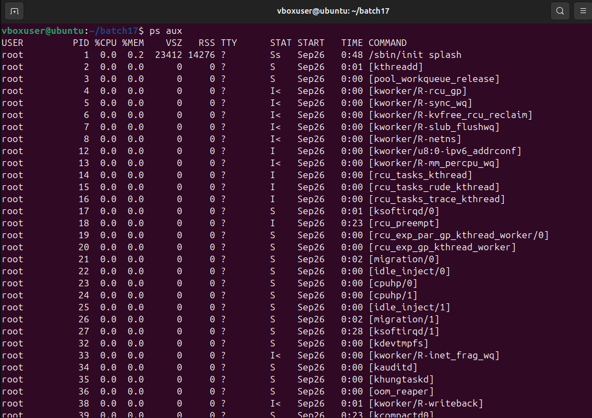
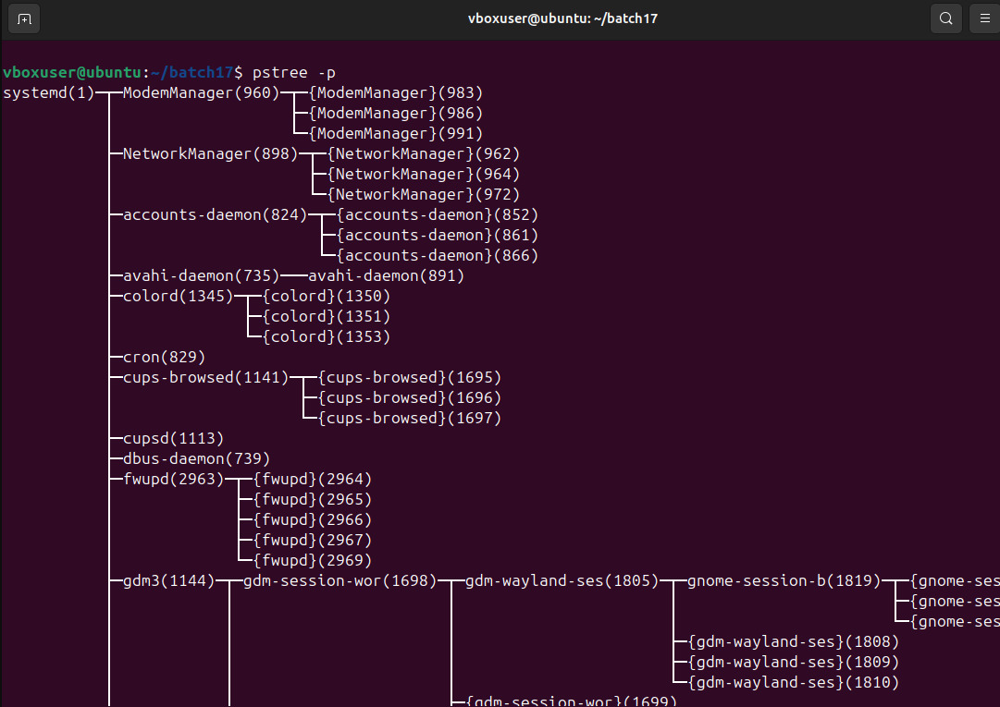
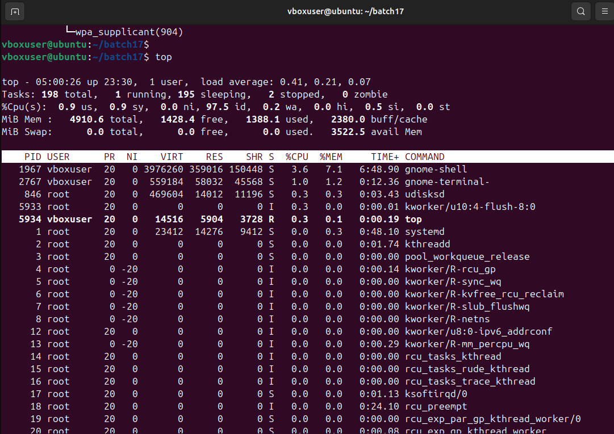
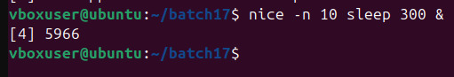
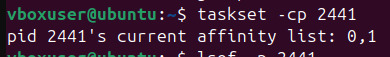
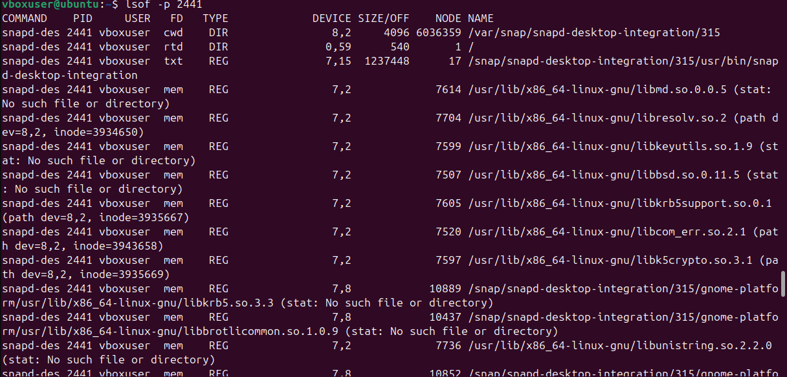
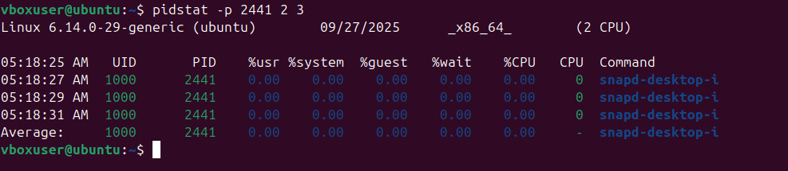

# 📌 Linux Process Management Commands

This document explains various Linux commands used to manage and monitor processes in Linux. Each section contains the **command**, its **purpose**, and an **example output**.

---

## 🌲 1. List Processes: `ps aux`

The `ps` command displays information about currently running processes.

* `a` → show processes for all users
* `u` → show user/owner of process
* `x` → show processes not attached to a terminal

```bash
ps aux
```

✅ **Explanation:**
This lists all active processes along with details such as **process ID (PID)**, **CPU and memory usage**, and the **command used to start it**. It is often the first step in monitoring system activity.



---

## 🌳 2. Process Tree: `pstree -p`

The `pstree` command shows the parent-child relationship of processes in a tree-like format.

```bash
pstree -p
```

✅ **Explanation:**
This helps visualize which processes were started by others (e.g., `sshd` starting a `bash` session). It is useful for understanding dependencies between processes.



---

## 📊 3. Real-Time Monitoring: `top`

The `top` command displays **real-time system statistics**, including CPU usage, memory usage, and running processes.

```bash
top
```

👉 Press `q` to quit.

✅ **Explanation:**
`top` continuously updates the list of running processes, allowing you to identify which process is consuming the most resources. It is widely used for **performance monitoring**.


---

## ⚡ 4. Adjust Process Priority

Linux uses a **priority system** for processes. Lower values mean higher priority.

* Start a process with low priority:

```bash
nice -n 10 sleep 300 &
```


* Change priority of a running process:

```bash
renice -n -5 -p 3050
```

✅ **Explanation:**

* `nice` starts a process with a given priority.
* `renice` changes the priority of an already running process.
  This is useful for ensuring important tasks run faster than background ones.


---

## 🔧 5. CPU Affinity: `taskset`

`taskset` sets or retrieves the **CPU affinity** of a process, meaning which CPU cores it can run on.

* Show affinity:

```bash
taskset -cp 3050
```

* Restrict to core 1 only:

```bash
taskset -cp 1 3050
```

✅ **Explanation:**
By binding a process to specific CPUs, you can optimize performance or prevent a process from interfering with others.


---

## 📂 6. I/O Scheduling Priority: `ionice`

The `ionice` command sets a process’s **I/O scheduling priority** (disk read/write operations).

```bash
ionice -c 3 -p 3050
```

✅ **Explanation:**
Here, class 3 (`idle`) means the process only gets I/O time when no other process is using the disk. This prevents background jobs from slowing down critical applications.


---

## 📑 7. File Descriptors: `lsof`

The `lsof` (List Open Files) command lists files opened by a process.

```bash
lsof -p 15082
```

✅ **Explanation:**
In Linux, everything is treated as a file (regular files, devices, sockets). `lsof` helps identify which files a process is using — very useful for troubleshooting.



---

## 🐛 8. Trace System Calls: `strace`

`strace` shows the **system calls** made by a process.

```bash
strace -p 3050
```

✅ **Explanation:**
This is especially useful for debugging, as you can see what the process is doing behind the scenes (e.g., opening files, reading data, making network calls).


---

## 📡 9. Find Process Using a Port: `fuser`

`fuser` identifies which process is using a given port.

```bash
sudo fuser -n tcp 8080
```

✅ **Explanation:**
This is useful when a service (like a web server) fails to start because the port is already occupied. `fuser` helps find and stop the conflicting process.


---

## 📊 10. Per-Process Stats: `pidstat`

The `pidstat` command provides detailed statistics of a specific process.

```bash
pidstat -p 3050 2 3
```

✅ **Explanation:**
It reports CPU usage, memory consumption, and other metrics for individual processes at given intervals. This makes it useful for performance profiling.



---

## 🔐 11. Control Groups (cgroups)

Control Groups (`cgroups`) allow administrators to **limit and allocate resources** (CPU, memory) to processes.

* Create new cgroup:

```bash
sudo cgcreate -g cpu,memory:/testgroup
```

* Limit CPU and Memory:

```bash
echo 50000 | sudo tee /sys/fs/cgroup/cpu/testgroup/cpu.cfs_quota_us
echo 100M   | sudo tee /sys/fs/cgroup/memory/testgroup/memory.limit_in_bytes
```

* Add process (PID 3050) to cgroup:

```bash
echo 3050 | sudo tee /sys/fs/cgroup/cpu/testgroup/cgroup.procs
```

✅ **Explanation:**
Cgroups are powerful for **resource control**. For example, you can prevent a single process from consuming too much CPU or memory, ensuring system stability.


---

